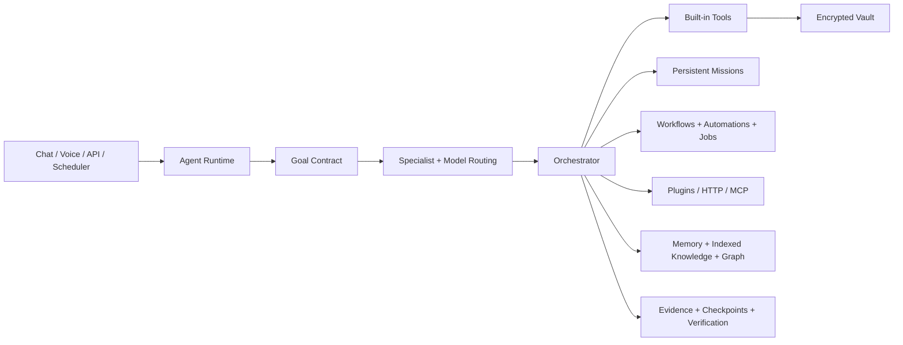

<h1 align="center">DPN AI</h1>

<p align="center"><strong>Developed by DPN Technology</strong></p>

<p align="center">
  
  
  
  
  <a href="https://github.com/directordiesel/DPN-AI/actions/workflows/ci.yml"></a>
</p>

> **Published stable release:** v6.0.0 · Advanced Core  
> **Release candidate:** v8.0.0 · Windows Desktop Platform  
> **Technology:** Python · Local AI · Missions · Tools · Voice · MCP · Automation · Multimodal

## v8.0.0 Release Candidate Status

DPN AI v8.0.0 is implementation-complete on the dedicated desktop development branch and is being held behind strict release-readiness gates. It is not yet published as the stable GitHub release.

The v8 desktop line adds:
- native Windows desktop launcher/supervisor and safe-mode recovery
- black/purple Desktop Control Center with live runtime status
- versioned desktop API and protected SSE status stream
- Windows executable packaging and installer foundations
- updater/rollback integrity contracts
- per-user Windows startup/context-menu/tray integration
- persistent crash journaling, integrity-tagged backups, and diagnostics hardening
- CPU/RAM pressure controls and model lifecycle management
- dedicated v8 security, QA, packaging, and release-readiness workflows

Final stable publication remains blocked only by:
- coordinated version promotion across `VERSION`, runtime `APP_VERSION`, UI stable-core/version markers, and related release metadata
- genuine production Windows code-signing integration and verification
- final exact-head release gates and explicit stable merge/release authorization

## Download Current Published Release

The current verified published stable release is **v6.0.0**.

| Release Resource | Link |
| --- | --- |
| GitHub Release | [DPN AI v6.0.0](https://github.com/directordiesel/DPN-AI/releases/tag/v6.0.0) |
| Source archive | [`DPN-AI-v6.0.0-source.zip`](https://github.com/directordiesel/DPN-AI/releases/download/v6.0.0/DPN-AI-v6.0.0-source.zip) |
| SHA-256 checksums | [`SHA256SUMS.txt`](https://github.com/directordiesel/DPN-AI/releases/download/v6.0.0/SHA256SUMS.txt) |
| Release manifest | [`RELEASE_MANIFEST.txt`](https://github.com/directordiesel/DPN-AI/releases/download/v6.0.0/RELEASE_MANIFEST.txt) |
| SPDX SBOM | [`SBOM.spdx.json`](https://github.com/directordiesel/DPN-AI/releases/download/v6.0.0/SBOM.spdx.json) |
| Source integrity manifest | [`SOURCE_SHA256SUMS.txt`](https://github.com/directordiesel/DPN-AI/releases/download/v6.0.0/SOURCE_SHA256SUMS.txt) |

Release artifacts are generated from the verified release commit through controlled GitHub Actions release gates.

## Overview

DPN AI is a local-first AI operations platform designed for agentic software engineering, artifact creation, multimodal work, automation, persistent projects, research, connectors, memory, verification, recovery, and controlled computer/web capabilities.

The platform is intentionally more than a chat interface. It can plan work, execute approved tools, persist state, create artifacts, operate multi-step missions, schedule jobs, connect to reviewed services, retain evidence, recover from failures, and apply approval/security boundaries before side effects.

## Stable v6 Advanced Core

v6.0.0 established the production foundation used by later development lines, including:
- Universal Creator foundation
- Coding Agent
- Document and artifact workflows
- Image and vision planning
- Research/browser agent capability
- Repository intelligence
- Multimodal ingestion
- Model routing and cognitive orchestration
- Persistent memory and knowledge graph capability
- Mission recovery and self-evaluation
- Automation operations
- Connector orchestration
- Artifact preview/capability experience
- Native vision reasoning foundations
- Release readiness and security gates

## v8 Desktop Platform Roadmap

The v8 integration branch contains all planned implementation batches:
1. Desktop platform foundation and security contracts
2. Native launcher/supervisor and safe mode
3. Desktop Control Center shell/navigation
4. Unified desktop API and SSE status stream
5. Windows executable packaging foundation
6. Installer/repair/upgrade/uninstall foundation
7. Signed updater/rollback verification contract
8. Windows startup/context-menu/tray integration
9. Crash recovery/backups/diagnostics hardening
10. Performance/resource/model lifecycle controls
11. Comprehensive security/QA/package validation
12. Strict v8 release gates

The v8 branch remains separate from stable `main` until final release blockers are resolved and an explicit merge/release is authorized.

## Core Execution Model

```text
User / API / Automation
        ↓
Goal Contract
        ↓
Agent Runtime / Specialist Routing
        ↓
Plan + Dependencies + Approval Gates
        ↓
Focused Tools / Connectors / Models
        ↓
Execution + Checkpoints + Recovery
        ↓
Evidence Verification
        ↓
Persistent Result / Artifact / Audit
```

## Agent Runtime

DPN AI supports bounded specialist orchestration with planner, coder, researcher, creator, automation, critic, and verifier roles. Agentic work remains subject to tool permissions, runtime budgets, approval boundaries, cancellation, checkpoints, and evidence requirements.

## Autonomous Coding

The coding path is designed around repository-aware work rather than isolated snippets:
- map repository structure and dependencies
- plan minimal multi-file change sets
- identify high-risk or destructive operations
- edit implementation files
- compile and run targeted tests
- run regression/security checks
- inspect failures and repair safely
- review the final diff
- require changed-file and passing-check evidence before claiming completion

Tests and security gates must not be weakened merely to make a change pass.

## Creator Engine

The creator layer coordinates documents, PDFs, spreadsheets, presentations, images, charts, audio, video, code, and bundles. It applies dependency ordering, native-format generation, source grounding, branding consistency, cross-artifact checks, explicit overwrite policy, and post-generation inspection.

## Automation & Scheduling

DPN AI includes scheduled and persistent automation foundations with:
- schedule/condition validation
- approval gates before side effects
- overlap policy
- bounded retries and backoff
- runtime limits
- persistent run history
- checkpoint-before-side-effect policy
- restart recovery
- idempotency expectations
- cancellation
- explicit success/failure evidence

## Projects, Memory & Knowledge

Persistent project intelligence can combine:
- conversation history
- long-term memory
- project context
- indexed documents
- semantic retrieval
- provenance-aware knowledge graph records
- source and confidence metadata

Retrieved evidence should remain distinguishable from model assumptions.

## Documents & Office Artifacts

Built-in Python tooling supports controlled workspace creation/manipulation of common business formats including:
- Word documents
- PDF documents
- Excel spreadsheets
- PowerPoint presentations
- charts and data outputs

Generated outputs should be opened or parsed after creation when practical so structural failures are not reported as success.

## Images, Vision & Media

DPN AI supports image/vision and media adapter workflows, including optional local image-generation backends such as ComfyUI. Audio/video processing can use FFmpeg where installed. Multimodal capability remains dependent on the configured models and local services.

## Voice

Local voice support includes microphone transcription and Piper-based speech output. Existing Sentinel HD voice capability remains available as part of the stable application line.

## Tool & Extension System

Capability can be extended through:
1. existing built-in tools
2. skill packs
3. deterministic workflows
4. approval-controlled HTTP connectors
5. reviewed MCP servers
6. staged local plugins through Capability Forge
7. core-code modification only when required

Tools must declare risk and remain subject to policy.

## MCP & Connectors

Optional MCP and connector systems allow reviewed external integrations. Controls can include tool allowlists, encrypted credentials, endpoint restrictions, approval gates, and audit records.

## Browser & Desktop Control

Optional browser and desktop adapters can enable controlled external interaction. These operations are considered higher risk because they can affect systems outside the DPN workspace and therefore remain approval/policy governed.

## Code Sandbox

DPN AI includes bounded code-execution concepts with resource and network restrictions. Stronger isolation such as Docker is recommended where available.

## Persistence

Operational state can include conversations, messages, memories, indexed knowledge, projects, tasks, runs, approvals, automations, workflows, missions, steps, goal contracts, checkpoints, evaluations, background jobs, MCP servers, connector records, and graph data.

Secrets belong in the encrypted vault rather than repository files or persistent plaintext state.

## Security

Never commit:
- `.env` files
- private keys
- vault keys
- passwords
- API tokens
- production databases
- private runtime state
- generated secrets or authentication recovery data

Security, repository-health, runtime/recovery, release integrity, and CI gates are part of the expected engineering workflow.

## Recovery & Failure Model

DPN AI should preserve failures rather than claiming failed work succeeded. Recovery concepts include bounded retries, checkpoints, workspace snapshots, SHA-256 manifests, resumable jobs, explicit cancellation, repair loops, and rollback-capable extension promotion.

## System Architecture



## Installation & Startup

### Windows
Common scripts include:
- `INSTALL_DPN_AI.ps1`
- `install_windows.bat`
- `repair_windows.bat`
- `upgrade_windows.bat`
- `install_voice_windows.bat`
- `install_sentinel_hd_windows.bat`
- `install_mcp_windows.bat`
- `install_optional_capabilities_windows.bat`

Run:
```bat
run_dpn_ai.bat
```

### Linux
Install:
```bash
./install_linux.sh
```

Run:
```bash
./run_dpn_ai.sh
```

## Repository Layout

```text
app/       application, API, orchestration, persistence, adapters and tools
desktop/   v8 desktop runtime, supervisor, service facade, updater, integration and recovery
plugins/   trusted extension modules
skills/    reusable skill registrations
scripts/   operational/development helpers where present
docs/      architecture, security, release and capability documentation
tests/     regression, security, runtime and capability coverage
workspace/ restricted working area
data/      local runtime state; not for Git
```

## Validation Expectations

A significant change should normally pass:
- portable repository/version guard
- Python compilation
- full automated test suite
- DPN Security Gate
- Runtime & Recovery Assurance
- Repository Health
- DPN AI v8 Desktop Validation for v8 desktop changes
- relevant release/supply-chain gates before stable publication

## Current Status

| Item | Current State |
| --- | --- |
| Published stable release | **v6.0.0 · Advanced Core** |
| Release candidate | **v8.0.0 · Windows Desktop Platform** |
| Remaining blockers | **Coordinated version promotion + production Windows signing + final exact-head release gates** |
| PR status | **Draft until final release blockers and exact-head gates are cleared** |
| Repository visibility | **Private** |
| Publisher | **DPN Technology** |
| Primary stack | Python · Local AI · Missions · Tools · Voice · MCP · Automation · Multimodal |
| Roadmap | [ROADMAP.md](ROADMAP.md) |

## Documentation

Key documentation includes:
- [`ROADMAP.md`](ROADMAP.md)
- [`CHANGELOG.md`](CHANGELOG.md)
- [`SECURITY.md`](SECURITY.md)
- [`RELEASE_PROCESS.md`](RELEASE_PROCESS.md)
- [`docs/ARCHITECTURE.md`](docs/ARCHITECTURE.md)
- [`docs/UNIVERSAL_CAPABILITIES.md`](docs/UNIVERSAL_CAPABILITIES.md)
- [`docs/EXTENSIONS.md`](docs/EXTENSIONS.md)
- [`docs/COGNITIVE_KERNEL.md`](docs/COGNITIVE_KERNEL.md)
- [`docs/MODEL_GATEWAY.md`](docs/MODEL_GATEWAY.md)
- [`docs/MCP.md`](docs/MCP.md)

## Development Standards

- Keep credentials, keys, databases, backups, and private operational data out of Git.
- Update release/version metadata and documentation together.
- Add or update regression tests for production defects and new capability packages.
- Preserve compatibility until replacement behavior is verified.
- Separate demo/default behavior from production requirements.
- Do not bypass security or weaken tests to force CI green.
- Require explicit evidence before autonomous systems report completion.

---

<p align="center"><strong>DPN Technology</strong><br>We Develop what doesn't exist. We Pioneer what comes next. We Navigate the future.</p>
