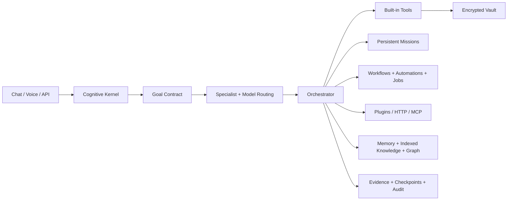

<h1 align="center">DPN AI</h1>

<p align="center"><strong>Developed by DPN Technology</strong></p>

<p align="center">
  
  
  
  
    <a href="https://github.com/directordiesel/DPN-AI/actions/workflows/ci.yml"></a>
  <a href="https://github.com/directordiesel/DPN-AI/releases/tag/v6.0.0"></a>
</p>

> **Stable release:** v6.0.0 · Advanced Core  
> **Technology:** Python · Local AI · Missions · Tools · Voice · MCP

### Quick navigation
[Overview](#overview) · [Architecture](#system-architecture) · [Installation](#installation--startup) · [Security](#security) · [Roadmap](ROADMAP.md) · [Release](#download-current-release) · [Documentation](#documentation)

## Download Current Release

The current verified stable release is **v6.0.0**.

| Release Resource | Link |
| --- | --- |
| GitHub Release | [DPN AI v6.0.0](https://github.com/directordiesel/DPN-AI/releases/tag/v6.0.0) |
| Source archive | [`DPN-AI-v6.0.0-source.zip`](https://github.com/directordiesel/DPN-AI/releases/download/v6.0.0/DPN-AI-v6.0.0-source.zip) |
| SHA-256 checksums | [`SHA256SUMS.txt`](https://github.com/directordiesel/DPN-AI/releases/download/v6.0.0/SHA256SUMS.txt) |
| Release manifest | [`RELEASE_MANIFEST.txt`](https://github.com/directordiesel/DPN-AI/releases/download/v6.0.0/RELEASE_MANIFEST.txt) |
| SPDX SBOM | [`SBOM.spdx.json`](https://github.com/directordiesel/DPN-AI/releases/download/v6.0.0/SBOM.spdx.json) |
| Source integrity manifest | [`SOURCE_SHA256SUMS.txt`](https://github.com/directordiesel/DPN-AI/releases/download/v6.0.0/SOURCE_SHA256SUMS.txt) |
| Dependency inventory | [`DEPENDENCY_INVENTORY.txt`](https://github.com/directordiesel/DPN-AI/releases/download/v6.0.0/DEPENDENCY_INVENTORY.txt) |

> Release artifacts are generated from the verified release commit by the repository's controlled GitHub Actions release pipeline.

## Overview
DPN AI is a local-first AI operations platform built around chat, tool execution, projects, memory, knowledge indexing, document generation, voice, automation, mission planning, multi-agent review, plugins, MCP integrations, model gateways, and controlled computer/web capabilities.

The system is designed to act as more than a chat interface. DPN AI can build structured plans, execute approved tools, persist state, create artifacts, run multi-step missions, schedule jobs, connect to local/remote services, and retain evidence/audit history while enforcing workspace and security boundaries.

## Design Principles

DPN AI v6 is built around:
- Local-first operation
- Explicit tool boundaries
- Approval-aware execution
- Persistent missions and jobs
- Evidence over unsupported claims
- Encrypted secret storage
- Recoverable workspaces
- Extensible tools/plugins/connectors
- Model-provider flexibility
- Clear separation between built-in capability and optional adapters

## Core Request Pipeline

A typical request follows this path:

```text
User/API Request
      ↓
Cognitive Kernel
      ↓
Goal Contract
      ↓
Specialist / Profile Routing
      ↓
Context Assembly
      ↓
Model + Focused Tool Set
      ↓
Policy / Approval / Resource Gates
      ↓
Tool Execution
      ↓
Evidence / Artifacts / Audit
      ↓
Persistent Result
```

Supported request types include:
- Direct requests
- Missions
- Workflows
- Automations
- Voice requests
- Background jobs

## Local AI Chat

DPN AI supports conversational interaction with:
- Persistent conversations
- Message history
- Tool use
- Context retrieval
- Project context
- Memory
- Indexed documents
- Knowledge graph context

Local models can be used through Ollama, with a compatible model-gateway layer available for other supported endpoints.

## Cognitive Kernel

The cognitive kernel converts higher-level requests into structured execution intent.

Capabilities include:
- Goal-contract derivation
- Specialist routing
- Context selection
- Tool-set focusing
- Mission planning
- Evidence verification
- Review orchestration
- Recovery/repair paths

## Multi-Agent Missions

Mission execution is a persistent workflow rather than a one-shot model response.

Mission path:
1. Derive goal contract
2. Generate plan or deterministic fallback
3. Normalize plan/dependencies
4. Create persistent mission and steps
5. Execute specialists with retry limits
6. Checkpoint progress
7. Verify evidence
8. Attempt repair when appropriate
9. Run independent reviews
10. Calculate weighted consensus
11. Persist final mission result

Mission budgets and retry limits prevent unbounded autonomous execution.

## Projects & Workspace

Projects provide organized work areas for:
- Code
- Documents
- Data
- Media
- Generated artifacts
- Mission outputs
- Reference files

Built-in file tools are restricted to the DPN workspace boundary.

## Memory & Knowledge

DPN AI persists multiple forms of context:
- Conversation history
- Long-term memory
- Indexed documents
- Semantic search data
- Project context
- Provenance knowledge graph
- Source/confidence metadata

The system is designed to distinguish retrieved evidence from model assumptions.

## Provenance Knowledge Graph

Knowledge graph records can retain:
- Entities
- Relationships
- Source information
- Confidence
- Provenance metadata

This supports traceable reasoning across persistent projects.

## Document & Office Artifact Creation

DPN AI includes tools for creating/manipulating common business formats such as:
- Word documents
- PDFs
- Excel spreadsheets
- PowerPoint presentations

Document tooling is bounded to the controlled workspace.

## Media Capabilities

Built-in/adapter-supported media workflows include:
- Images
- Vision
- Audio
- Video
- FFmpeg-backed processing
- Local image-generation adapter support
- Attachment handling

ComfyUI can be used as an optional image-generation backend.

## Voice Assistant

DPN AI supports local voice interaction.

### Speech Input
Optional local transcription can use:
- faster-whisper

### Speech Output
Piper voice support includes local male/female voice models.

### Sentinel HD — v5.0.7
The v5.0.7 voice upgrade adds:
- Primary model: `en_US-ryan-high`
- Fallback model: `en_GB-alan-medium`
- Faster default delivery
- Clear/Natural/Warm tone choices
- Reduced over-processing
- Lower synthesis noise
- More natural pauses
- UI indication of HD versus legacy model

Install the HD model on Windows with:
```bat
install_sentinel_hd_windows.bat
```

## Adaptive Interface — v5.0.7

The current interface includes fixes for real-world browser/display constraints:
- Browser-height bounded modals
- Internal scrolling for large tables/boards
- Wrapping toolbars/forms/buttons
- Short-height responsive mode
- Narrow-screen responsive mode
- Independent sidebar/chat/composer/modal scroll regions
- Stale-template repair
- Cache mismatch recovery screen

## Tool System

DPN AI includes a registry-based tool architecture.

Built-in tool categories include:
- Filesystem
- Shell/commands
- Documents
- Images/media
- Knowledge
- Web/research
- Registry/discovery

Tools declare risk and remain subject to policy.

## Software & Development Workflows

The platform is designed to support:
- General software development
- Project editing
- Test execution
- Build/release workflows
- FiveM development workflows
- Data science/engineering workflows

Skill packs included in the repository cover several of these domains.

## Skill Packs

Reusable JSON skill packs include:
- Business automation
- Capability Forge
- Cognitive mission control
- Computer operations
- Data science/engineering
- Document factory
- FiveM production
- MCP integration governance
- Media production
- Security verification
- Software release
- Universal execution
- Voice assistant

## Workflows

Deterministic workflows can be used for repeatable processes where fixed execution is preferable to unconstrained model planning.

## Automations

Scheduled automation support allows recurring controlled tasks while DPN AI is running.

Automation execution remains subject to:
- Tool gates
- Permissions
- Runtime state
- Resource controls

## Background Job Queue

DPN AI can run queued background jobs with:
- Persistent job records
- Retry behavior
- Cancellation
- Status tracking

The application must remain available for local background processing.

## Capability Forge

Capability Forge is the controlled extension pipeline for adding new local capabilities.

A staged capability can be:
1. Created
2. Validated
3. Reviewed
4. Approved
5. Promoted
6. Activated after restart

Plugin replacements preserve rollback copies.

## Plugin System

Trusted local plugins can extend the tool registry.

Plugins must expose:
```text
register(registry)
```

Security guidance:
- Keep tools narrow
- Validate inputs
- Declare risk accurately
- Do not embed secrets
- Use the encrypted vault
- Add tests
- Keep filesystem access inside intended boundaries

## HTTP Connectors

DPN AI can connect to external HTTP services through approval-controlled connectors.

Connector security can include:
- Allowlisted endpoints
- Encrypted credentials
- Approval gates
- Structured request/response records

## MCP Bridge

Optional Model Context Protocol support allows DPN AI to connect to reviewed MCP servers.

Controls include:
- Per-server tool allowlists
- Audit records
- Explicit configuration
- Optional dependency package

Install MCP requirements through:
```text
requirements-mcp.txt
```

## Browser Automation

Optional Playwright integration can enable browser control.

Browser actions are treated as external operations and remain approval-controlled.

## Desktop Control

Optional desktop-control adapters can use tools such as pyautogui when a desktop session is available.

Desktop actions require explicit control gates because they can affect applications outside the DPN AI workspace.

## Code Sandbox

DPN AI includes a code-sandbox model with:
- Resource limits
- Network restrictions
- Controlled execution

Docker is recommended for stronger isolation.

## Model Gateway

DPN AI can route through:
- Ollama
- Compatible local/remote model servers

This allows different planner, worker, reviewer, vision, or specialist models to be selected without redesigning the core application.

## Persistence

SQLite stores operational state such as:
- Conversations
- Messages
- Memory
- Indexed knowledge
- Projects
- Tasks
- Runs
- Approvals
- Automations
- Workflows
- Missions
- Mission steps
- Goal contracts
- Knowledge-graph data
- Checkpoints
- Evaluations
- Background jobs
- MCP servers
- MCP call records

Secrets are intentionally stored outside SQLite in the encrypted vault.

## Encrypted Vault

Sensitive connector/tool credentials belong in the local encrypted vault rather than project files or source code.

Never commit:
- `.env`
- Vault keys
- API keys
- Tokens
- Passwords
- Local databases containing private context

## Recovery & Failure Model

DPN AI persists failures instead of pretending failed work succeeded.

Recovery concepts include:
- Mission attempts
- Step status
- Checkpoints
- Workspace snapshots
- SHA-256 manifests
- Retryable background jobs
- Repair operations
- Plugin rollback copies

## Capability Matrix

| Area | Built In | Optional Requirement |
| --- | --- | --- |
| Local chat/tool use | Yes | Ollama model |
| Model gateway | Yes | Compatible model server |
| Local voice | Yes | Piper voice models |
| Local transcription | Yes | faster-whisper |
| Images/vision | Yes | Vision model |
| Image generation | Adapter | ComfyUI |
| Audio/video | Yes | FFmpeg for full support |
| Word/PDF/Excel/PowerPoint | Yes | Core Python packages |
| Software/FiveM workflows | Yes | Project runtimes |
| Web research | Yes | Internet connection |
| Browser control | Adapter | Playwright |
| Desktop control | Adapter | pyautogui + desktop session |
| Cognitive contracts | Yes | None |
| Multi-agent missions | Yes | Planner/worker/reviewer models |
| Background jobs | Yes | App remains running |
| Knowledge graph | Yes | None |
| Code sandbox | Yes | Docker recommended |
| Capability Forge | Yes | None |
| MCP bridge | Adapter | MCP requirements |
| HTTP connectors | Yes | Target service/API |
| Scheduled automation | Yes | App remains running |
| Recovery snapshots | Yes | Disk space |

DPN AI does not claim universal access to every program, service, device, credential, or private dataset. Missing capability should be added explicitly through tools, adapters, plugins, connectors, or MCP.

## System Architecture



This is a high-level system map; implementation details remain in the repository source and project documentation.

## Installation & Startup

### Windows
For a clean install, use the included Windows installer/repair tooling.

Common scripts:
- `INSTALL_DPN_AI.ps1`
- `install_windows.bat`
- `repair_windows.bat`
- `upgrade_windows.bat`
- `install_voice_windows.bat`
- `install_sentinel_hd_windows.bat`
- `install_mcp_windows.bat`
- `install_optional_capabilities_windows.bat`

### Linux
```bash
./install_linux.sh
```

### Run
Windows:
```bat
run_dpn_ai.bat
```

Linux:
```bash
./run_dpn_ai.sh
```

## Docker

A `Dockerfile` and `docker-compose.yml` are included for containerized deployment/testing.

## Repository Layout

```text
app/
  main.py               API/application entry
  cognitive_kernel.py   Goal contracts and routing
  orchestrator.py       Mission/tool orchestration
  model_gateway.py      Model abstraction
  ollama_client.py      Ollama integration
  db.py                 Persistent application state
  vault.py              Secret storage
  workflows.py          Deterministic workflows
  automation.py         Scheduled automation
  job_supervisor.py     Background jobs
  knowledge_graph.py    Provenance graph
  capability_forge.py   Extension staging/promotion
  mcp_bridge.py         MCP client bridge
  voice_adapter.py      Local voice
  browser_adapter.py    Optional browser control
  desktop_adapter.py    Optional desktop control
  media.py              Media processing
  tools/                Built-in tools
  static/               Web control center

skills/                  Reusable skill packs
plugins/                 Local plugin examples
docs/                    Architecture and capability docs
tests/                   Regression/security/capability tests
workspace/               Restricted project workspace
data/                    Local runtime data (not for Git)
```

## Testing

The repository contains tests for:
- Agent behavior
- Document generation
- Image/media handling
- Security
- Control plane
- Tool registry/policy
- Universal core
- Voice/model gateway/media
- Chat recovery
- Cognitive autonomy
- Intelligence/document editing
- UI layout
- UI/voice polish
- Voice narration

## Recommended Extension Order

When adding a capability:
1. Existing built-in tool
2. Skill pack
3. Deterministic workflow
4. Approval-controlled HTTP connector
5. Reviewed MCP server
6. Staged local plugin through Capability Forge
7. Core-code modification only when required

## Current Status

DPN AI v6.0.0 is the current verified stable release and remains an actively developed local-first AI operations platform. Optional capabilities still depend on local services, models, operating-system access, external APIs, and explicit user configuration.

## Project Status

| Item | Current State |
| --- | --- |
| Stable release | **v6.0.0 · Advanced Core** |
| Development | **Active** |
| Repository visibility | **Private** |
| Publisher | **DPN Technology** |
| Primary stack | Python · Local AI · Missions · Tools · Voice · MCP |
| Roadmap | [View ROADMAP.md](ROADMAP.md) |

## Documentation
- [`docs/ARCHITECTURE.md`](docs/ARCHITECTURE.md)
- [`docs/UNIVERSAL_CAPABILITIES.md`](docs/UNIVERSAL_CAPABILITIES.md)
- [`docs/EXTENSIONS.md`](docs/EXTENSIONS.md)
- [`docs/COGNITIVE_KERNEL.md`](docs/COGNITIVE_KERNEL.md)
- [`docs/MODEL_GATEWAY.md`](docs/MODEL_GATEWAY.md)
- [`docs/MCP.md`](docs/MCP.md)
- [`CHANGELOG.md`](CHANGELOG.md)

## Development Standards
- Keep credentials, keys, databases, backups, and private operational data out of Git.
- Update version metadata and documentation together.
- Add/update regression tests for production defects.
- Preserve compatibility code until replacement behavior is verified.
- Separate demo/default behavior from production requirements.

---

<p align="center"><strong>DPN Technology</strong><br>Developing connected systems, software, operations platforms, and simulation technology.</p>