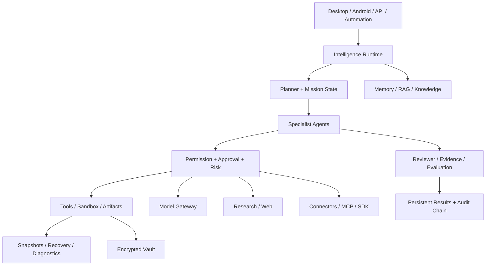

<h1 align="center">DPN AI</h1>

<p align="center"><strong>Local-first autonomous AI operations platform by DPN Technology</strong></p>

<p align="center">
  
  
  
  
  <a href="https://github.com/directordiesel/DPN-AI/actions/workflows/ci.yml"></a>
</p>

<p align="center">
  <strong>Stable release:</strong> v9.0.0 &nbsp;•&nbsp;
  <strong>Publisher:</strong> DPN Technology &nbsp;•&nbsp;
  <strong>Primary stack:</strong> Python + Local AI + Desktop + Android + Agents + Tools
</p>

---

## What DPN AI Is

DPN AI is an evidence-driven, local-first AI operations platform designed to do substantially more than chat. It combines agent orchestration, coding assistance, project memory, retrieval, research, office-artifact creation, voice, image generation, automation, model routing, connectors, recovery systems, desktop/mobile interfaces, security controls, and release engineering inside one coordinated application architecture.

The platform is built around a simple operating principle: **powerful AI actions should remain observable, bounded, reviewable, recoverable, and subject to explicit permissions.**

DPN AI can plan multi-step work, route tasks to specialized agents, invoke approved tools, create artifacts, analyze repositories, perform research, retain scoped memory, schedule workflows, use local models, interact with reviewed integrations, record evidence, and recover from failures without pretending an unsupported or failed capability succeeded.

## Download v9.0.0

The current published stable release is **DPN AI v9.0.0**.

| Release resource | Link |
| --- | --- |
| GitHub Release | [DPN AI v9.0.0](https://github.com/directordiesel/DPN-AI/releases/tag/v9.0.0) |
| Source archive | [`DPN-AI-v9.0.0-source.zip`](https://github.com/directordiesel/DPN-AI/releases/download/v9.0.0/DPN-AI-v9.0.0-source.zip) |
| SHA-256 checksum | [`SHA256SUMS.txt`](https://github.com/directordiesel/DPN-AI/releases/download/v9.0.0/SHA256SUMS.txt) |
| Release manifest | [`RELEASE_MANIFEST.txt`](https://github.com/directordiesel/DPN-AI/releases/download/v9.0.0/RELEASE_MANIFEST.txt) |
| SPDX SBOM | [`SBOM.spdx.json`](https://github.com/directordiesel/DPN-AI/releases/download/v9.0.0/SBOM.spdx.json) |
| Source integrity manifest | [`SOURCE_SHA256SUMS.txt`](https://github.com/directordiesel/DPN-AI/releases/download/v9.0.0/SOURCE_SHA256SUMS.txt) |
| Dependency inventory | [`DEPENDENCY_INVENTORY.txt`](https://github.com/directordiesel/DPN-AI/releases/download/v9.0.0/DEPENDENCY_INVENTORY.txt) |

Release artifacts are generated by the controlled GitHub Actions release pipeline after version checks, repository-state checks, tests, SBOM generation, source hashing, and release validation.

## v9.0.0 at a Glance

| Area | v9 capability |
| --- | --- |
| Intelligence | Planner / executor / reviewer orchestration with dependencies, retries, evidence, and failure blocking |
| Coding | Repository-aware engineering, change-risk analysis, test planning, CI diagnosis, and self-review foundations |
| Tools | Permission-aware tools, risk classification, approval boundaries, sandbox controls, timeouts, and auditability |
| Memory | Scoped persistent memory, semantic retrieval, RAG, context assembly, and knowledge-base foundations |
| Research | Web research runtime, source ranking, evidence collection, and contradiction/conflict handling |
| Artifacts | DOCX, PDF, XLSX, PPTX, structured data, validation metadata, and Artifact Studio orchestration |
| Images | Real ComfyUI image generation plus provider-ready editing and vision routes that fail closed when unconfigured |
| Automation | Persistent scheduling, workflow dependencies, retries, overlap policy, run history, and recovery foundations |
| Voice | Offline/local STT/TTS architecture, Piper voices, faster-whisper support, session state, and barge-in controls |
| Desktop | Black/purple Control Center, command palette, live activity surfaces, approvals/tasks, and accessibility improvements |
| Android | Secure pairing, device trust, credential revocation, authenticated gateway controls, chat/tasks/approvals/voice foundations |
| Models | Local-first model routing, Ollama support, OpenAI-compatible endpoints, capability/health scoring, and bounded fallback |
| Security | Encrypted vault, approval revalidation, prompt-injection defenses, network policy, tamper-evident audit chains |
| Recovery | Snapshots, integrity checking, rollback/recovery controls, diagnostics, updater/release readiness |
| SDK / Integrations | Governed connector requests, idempotency expectations, SDK contracts, and integration safety boundaries |
| Evaluation | Production-readiness scoring, regression/security evaluations, critical-case fail-closed behavior |
| Release Engineering | Version coherence, SBOM/checksums, release manifests, package verification, rollback evidence, exact-head gates |

## Core Operating Model

```text
User / Desktop / Android / API / Automation
                  ↓
            Goal Contract
                  ↓
      Intelligence + Task Planning
                  ↓
       Specialist Agent Routing
                  ↓
   Permission / Risk / Approval Layer
                  ↓
 Tools / Models / Research / Connectors
                  ↓
 Execution + Checkpoints + Recovery
                  ↓
 Evidence + Reviewer Verification
                  ↓
 Result / Artifact / Audit / Memory
```

## Intelligence Core

The v9 intelligence runtime introduces deterministic planner/executor/reviewer orchestration with explicit task dependencies and mission state. Work can be decomposed into ordered steps, retried within bounded policies, blocked when required evidence is missing, and summarized with explicit progress state.

The goal is not unbounded autonomy. The goal is **controlled autonomy with observable state and verifiable outcomes**.

## Coding Agent + GitHub Engineering

DPN AI includes repository-engineering foundations designed for real multi-file software work:

- inspect repository structure and relevant implementation context
- plan focused changes instead of blindly rewriting projects
- classify diff risk and escalate high-severity findings
- detect dependency and architecture concerns
- select or recommend validation paths
- diagnose GitHub Actions failures
- separate demonstrated causes from speculation
- retain evidence about changed files and validation results
- self-review before completion

Security checks and tests are not supposed to be weakened merely to force a green result.

## Agents and Orchestration

The v9 architecture supports specialized agent roles including general assistance, coding, research, security, automation, artifact/document work, and review. A supervisor-oriented architecture coordinates tasks while preserving permissions, runtime boundaries, evidence requirements, cancellation, and failure states.

## Tool, Permission, and Sandbox Architecture

Tools are governed by policy rather than treated as unrestricted functions. The v9 stack includes:

- tool risk classification
- permission-aware execution
- approval requirements for sensitive operations
- sandbox and host-fallback boundaries
- timeouts and bounded execution
- workspace containment
- audit trails
- fail-closed handling when capability requirements are not met

Permission concepts include Ask Every Time, session-scoped permission, persistent permission, and deny-style behavior where supported by the calling surface.

## Memory, RAG, and Knowledge

DPN AI v9 can combine project context, long-term memory, semantic retrieval, indexed sources, and conversation state. The retrieval architecture is designed to keep sourced evidence distinguishable from model assumptions.

Core concepts include:

- project-scoped memory
- semantic indexing
- retrieval and reranking foundations
- source-aware context assembly
- context budgeting
- knowledge-base isolation
- persistent agent context seams

## Research + Web Intelligence

The research runtime provides a governed path for multi-source investigation. It supports structured research operations, evidence collection, source comparison, and claim-conflict detection foundations.

External content is treated as data, not trusted instructions. Network access remains subject to policy and permission boundaries.

## Artifact Studio

DPN AI can create and coordinate common business artifacts through controlled workspace tooling:

- Microsoft Word / DOCX
- PDF
- Excel / XLSX
- PowerPoint / PPTX
- CSV and structured data outputs
- charts and analytical outputs
- Markdown and text deliverables

Artifact creation includes validation and integrity metadata so generation is not automatically treated as successful merely because a file was written.

## Images, Vision, and Media

### Image generation

DPN AI includes a real ComfyUI-backed image-generation provider when a compatible ComfyUI endpoint and workflow are configured.

### Image editing and vision

v9 includes provider routing, validation, workspace containment, capability discovery, and fail-closed execution for image editing and vision analysis. **Editing and vision require a configured provider implementation.** DPN AI does not report those operations as live when a capable provider is absent.

This distinction is intentional and is part of the platform's evidence-first design.

## Voice and Multimodal Sessions

The local voice stack includes offline-oriented speech capabilities with:

- faster-whisper STT support when installed
- Piper neural voice support
- system voice fallback
- DPN Sentinel and DPN Aurora voice profiles
- synthesis/transcription diagnostics
- session state
- multimodal attachments
- barge-in/interruption state
- hands-free session foundations

Mobile voice capture remains constrained by the Android foreground/session security model.

## Automation and Workflow Runtime

Automation in v9 is more than a simple timer. The architecture includes:

- one-time, recurring, and condition-oriented definitions
- persisted automation state
- step dependencies
- overlap policies such as skip/queue/replace
- bounded retry policies
- capped exponential backoff
- approval-aware destructive steps
- evidence requirements
- run history
- stale-run recovery foundations
- restart-safe execution state

Condition-based execution requires a compatible condition provider and fails closed when one is not configured.

## Desktop Control Center

The v9 desktop experience extends the DPN black/purple interface with:

- command palette
- keyboard shortcuts
- agent/task/approval routing
- live activity surfaces
- status-count mirroring
- responsive behavior
- accessibility-oriented live regions
- evidence-first action wording
- mobile-safe layout handling

The interface does not fabricate a successful cancel/pause/resume state when the runtime has not confirmed it.

## Android v2

Android v2 adds stronger device trust and remote-session controls:

- secure pairing foundations
- paired/revoked device states
- Android Keystore-backed session handling
- credential expiration and revocation enforcement
- authenticated desktop gateway checks
- shorter remote sessions
- user-presence requirements for remote writes
- explicit approval requirements for destructive actions
- chat, tasks, missions, approvals, files, diagnostics, notifications, voice, and vision-facing surfaces

Revoked devices fail closed and require re-pairing before remote functionality resumes.

## Model Gateway + Local AI

DPN AI is designed around a **local-first/private-first** model policy. The model gateway supports:

- Ollama as the default local provider
- OpenAI-compatible local or explicitly approved remote endpoints
- capability-aware routing
- health-aware routing
- vision-aware model scoring
- model warming and lifecycle state
- bounded fallback
- external-endpoint denial unless explicitly enabled
- streaming/tool/embedding compatibility foundations

Remote models do not bypass configured policy merely because a local model fails.

## Connectors, MCP, and SDK Governance

External integrations are treated as governed operations. v9 adds connector/MCP classification for inspect/read/write/delete/sync/execute operations, including requirements for:

- discovered actions
- allowlists
- approval for write-like actions
- idempotency keys for sensitive write/sync/execute requests
- operation caps
- write verification
- partial-failure reconciliation
- secret-reference use instead of plaintext secrets

The SDK/integration runtime builds on those same safety boundaries.

## Security Architecture

Security is a first-class subsystem, not a release checklist added at the end.

v9 includes foundations for:

- encrypted local secrets vault
- redacted persisted approval arguments
- exact deferred-argument recovery through the vault
- approval expiration and single-use semantics
- policy revalidation at execution time
- prompt-injection assessment
- plaintext-secret rejection
- network authorization and endpoint allowlists
- private/external network distinctions
- tamper-evident chained audit envelopes
- SHA-256 / HMAC-backed audit verification
- workspace/path containment
- destructive-action escalation

Never commit `.env` files, private keys, passwords, API tokens, vault master keys, production databases, runtime backups, authentication recovery data, or generated operational secrets.

## Recovery, Health, and Updating

DPN AI v9 includes recovery and operational-readiness foundations around:

- workspace snapshots
- integrity metadata
- recovery verification
- rollback readiness
- health reporting
- privacy-conscious diagnostics
- resource management
- updater verification concepts
- migration/recovery evidence

The system is designed to preserve failure state instead of silently converting failed operations into success.

## Evaluation + Production Readiness

The v9 evaluation suite provides weighted production-readiness decisions. Critical failures, skipped critical evaluations, and missing critical evidence fail closed.

Evaluation coverage includes security, permission boundaries, prompt injection, network policy, secret handling, integration safety, release readiness, and regression cases across the v9 architecture.

## Release Engineering

Stable release promotion requires version coherence and exact-head evidence. The release engineering layer validates:

- semantic version/channel rules
- exact Git commit identity
- version-source consistency
- required release artifacts
- SBOM/checksum/manifest evidence
- installer/package verification evidence
- rollback/recovery evidence
- v9 evaluation status
- CI status
- Security status
- Runtime/Recovery status

The GitHub release workflow independently compiles sources, runs tests, checks tracked sensitive state, generates the SBOM and source manifests, creates the source archive, computes checksums, and publishes the release.

## System Architecture



## Installation and Startup

### Windows

Common setup and maintenance scripts include:

- `INSTALL_DPN_AI.ps1`
- `install_windows.bat`
- `repair_windows.bat`
- `upgrade_windows.bat`
- `install_voice_windows.bat`
- `install_sentinel_hd_windows.bat`
- `install_mcp_windows.bat`
- `install_optional_capabilities_windows.bat`

Start DPN AI with:

```bat
run_dpn_ai.bat
```

### Linux

Install:

```bash
./install_linux.sh
```

Run:

```bash
./run_dpn_ai.sh
```

## Repository Layout

```text
app/        API, orchestration, persistence, intelligence, adapters and tools
desktop/    desktop runtime, supervisor, updater, integration and recovery components
android/    Android client and mobile integration surfaces where present
plugins/    trusted extension modules and capability registrations
skills/     reusable skill registrations
scripts/    operational and development helpers
docs/       architecture, security, release and capability documentation
tests/      regression, evaluation, security and runtime coverage
workspace/  restricted local working area
data/       local runtime state; not intended for source control
```

## Validation Expectations

Significant changes should normally pass the applicable combination of:

- repository/version guard
- Python compilation
- automated test suite
- DPN Security Gate v2
- Runtime & Recovery Assurance
- platform/mobile validation where relevant
- release/supply-chain checks before publication
- exact-head verification before merge or promotion

A green check from an older commit is not valid evidence for a newer head.

## Capability Honesty

DPN AI intentionally distinguishes between four states:

- **Available** — implementation and provider/runtime are present
- **Configurable** — architecture exists but requires an external/local provider or setup
- **Degraded** — capability exists but a preferred dependency is unavailable
- **Unavailable** — required capability is not configured and execution must fail closed

This is especially important for image editing, vision, condition providers, external integrations, signing, and remote capabilities.

## Current Status

| Item | Current state |
| --- | --- |
| Published stable release | **v9.0.0** |
| Release status | **Stable / published** |
| Development direction | **v9.1 hardening and capability expansion** |
| Repository visibility | **Public** |
| Publisher | **DPN Technology** |
| Architecture | **Local-first, evidence-driven, permission-aware** |
| Primary stack | **Python · Local AI · Agents · Tools · Voice · Desktop · Android · Automation · RAG** |
| Roadmap | [`ROADMAP.md`](ROADMAP.md) |
| Changelog | [`CHANGELOG.md`](CHANGELOG.md) |

## v9.1 Direction

Post-v9 development is focused on improving the stable architecture rather than replacing it. Priorities include stronger agent reliability, coding intelligence, permission consistency, memory/RAG quality, research verification, artifact quality, real configurable image-editing/vision providers, condition automation providers, voice robustness, desktop/mobile UX, model benchmarking/routing, vault/audit hardening, performance, recovery, SDK/integrations, evaluations, installer/release engineering, capability-state reporting, and production-readiness automation.

See [`ROADMAP.md`](ROADMAP.md) for the active engineering direction.

## Documentation

Key documentation includes:

- [`ROADMAP.md`](ROADMAP.md)
- [`CHANGELOG.md`](CHANGELOG.md)
- [`SECURITY.md`](SECURITY.md)
- [`RELEASE_PROCESS.md`](RELEASE_PROCESS.md)
- [`docs/ARCHITECTURE.md`](docs/ARCHITECTURE.md)
- [`docs/UNIVERSAL_CAPABILITIES.md`](docs/UNIVERSAL_CAPABILITIES.md)
- [`docs/EXTENSIONS.md`](docs/EXTENSIONS.md)
- [`docs/COGNITIVE_KERNEL.md`](docs/COGNITIVE_KERNEL.md)
- [`docs/MODEL_GATEWAY.md`](docs/MODEL_GATEWAY.md)
- [`docs/MCP.md`](docs/MCP.md)
- [`docs/V9_RELEASE_CANDIDATE.md`](docs/V9_RELEASE_CANDIDATE.md) — historical RC promotion policy retained for release-engineering reference

## Development Standards

- Keep credentials, private keys, databases, backups, generated secrets, and private runtime data out of Git.
- Use feature branches and reviewed pull requests for meaningful changes.
- Update version and release metadata together.
- Add regression coverage for production defects.
- Preserve compatibility until replacement behavior is verified.
- Keep production requirements separate from demo/default configuration.
- Do not bypass security controls or weaken tests to force CI green.
- Require explicit evidence before autonomous systems report completion.
- Revalidate after every head-changing commit.
- Prefer additive, reversible changes over destructive rewrites.

---

<p align="center"><strong>DPN Technology</strong><br><em>We Develop what doesn't exist. We Pioneer what comes next. We Navigate the future.</em></p>
